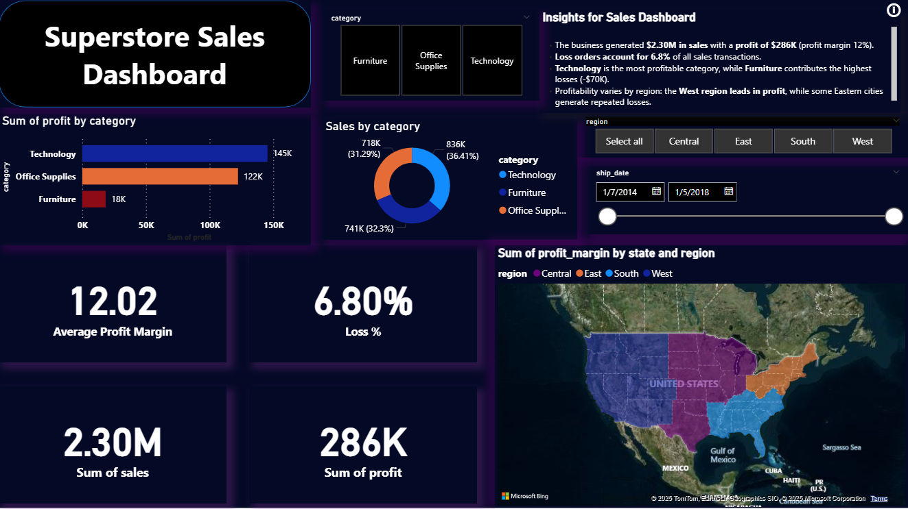

# Superstore Sales & Profitability Analysis Dashboard
### Problem Statement

The client, a retail store, struggled to identify which products, regions, and discounts were driving losses. Although overall sales looked strong, profit margins were inconsistent, and decision-makers lacked visibility into performance trends.

The goal was to build a data-driven dashboard that would:

* Track Main KPI Keys: (Sales, Profit, Profit Margin, Loss %)

* Identify loss-making products, regions, and categories

* Show the impact of discounts on profitability

* Provide actionable recommendations for business growth

## Approach

* Data Cleaning & Preparation

* Removed duplicates, handled missing values, standardized columns

* Added a Loss Flag column for orders with negative profit

### SQL Queries

* Aggregated profit/loss by Category, Region, and Product

* Analyzed discount distribution for profitable vs. loss orders
All the SQL Queries needed:
[SQL Queries](/sql_and_dax/superstore_sql.sql/)
### Excel Analysis

* Verified totals with pivot tables

* Calculated KPIs like Profit Margin %, Loss %, and AOV (Average Order Value)

### Power BI Dashboard

* **KPI Cards:** Total Sales (2.30M), Profit (286K), Loss % (6.8%), Avg Profit Margin (12%)

* **Category Analysis:** Furniture had highest losses (-70K) while Technology was most profitable

* **Regional/Geographic Analysis:** Losses concentrated in Philadelphia, Houston, and Chicago

* **Discount Analysis:** Loss orders had an average discount of 48%, while profitable orders averaged much lower.

Power BI DAX:
[DAX](/sql_and_dax/superstore_DAX_.md/)

You can get the Power BI Dashboard here,

* PDF Format:  [Power BI Dashboard PDF](/superstore_sales_powerbi.pdf/)

* pbix Format: [Power BI Dashboard pbix](/Superstore_Sales_powerbi.pbix/)

Also if you don't wanna do this , I'm keeping all the picture here,


*Overview Dashboard*


*Discount Impact Dashboard*


*Lose Analysis Dashboard*


## Key Insights

* Furniture category contributed the highest losses due to heavy discounting.

* West region performed well, while some cities (Philadelphia, Houston) consistently showed negative profits.

* High discounts directly correlated with losses → nearly half of discounted orders resulted in negative profit.

## Recommendations

* Reduce excessive discounting in Furniture and Office Supplies → even a 10% reduction could significantly improve margins.

* Focus on Technology category as it drives majority of profits → invest in marketing here.

* Re-evaluate unprofitable cities → consider adjusting logistics, pricing, or promotions.

* Implement dynamic discount rules → avoid blanket discounts that lead to losses.

## Impact

* This dashboard provides a clear view of sales vs. profitability, helping business leaders:

* Identify where the business is losing money

* Take data-driven pricing and discounting decisions

* Monitor KPIs in real-time for smarter strategy

### This case study shows end-to-end analytics skills:

**SQL** (data aggregation )

**Excel** (validation & KPI calc)

**Power BI** (dashboard & insights)

**Business storytelling** (turning numbers into action)

# SQL Query used for this project

```sql
-- 1. Create table
CREATE TABLE superstore (
    Row_ID INT,
    Order_ID TEXT,
    Order_Date DATE,
    Ship_Date DATE,
    Ship_Mode TEXT,
    Customer_ID TEXT,
    Customer_Name TEXT,
    Segment TEXT,
    Country TEXT,
    City TEXT,
    State TEXT,
    Postal_Code TEXT,
    Region TEXT,
    Product_ID TEXT,
    Category TEXT,
    Sub_Category TEXT,
    Product_Name TEXT,
    Sales NUMERIC,
    Quantity INT,
    Discount NUMERIC,
    Profit NUMERIC
);

-- 2. Import your dataset here (use \COPY in psql or import tool in pgAdmin)

-- 3. Data Cleaning
-- Remove duplicates
DELETE FROM superstore
WHERE ctid NOT IN (
    SELECT MIN(ctid)
    FROM superstore
    GROUP BY Order_ID, Product_ID
);

-- 4. Add calculated columns
ALTER TABLE superstore ADD COLUMN Profit_Margin NUMERIC;
ALTER TABLE superstore ADD COLUMN Loss_Flag INT;

UPDATE superstore
SET Profit_Margin = ROUND((Profit / Sales) * 100, 2),
    Loss_Flag = CASE WHEN Profit < 0 THEN 1 ELSE 0 END;

-- 5. Top loss-making products
SELECT "Product_Name", SUM(Profit) AS total_loss
FROM superstore
WHERE Profit < 0
GROUP BY "Product_Name"
ORDER BY total_loss ASC
LIMIT 10;

-- 6. Loss by category & region
SELECT Category, Region, SUM(Profit) AS total_profit
FROM superstore
GROUP BY Category, Region
ORDER BY total_profit ASC;

-- 7. Discount vs Profit trend
SELECT Discount, ROUND(AVG(Profit), 2) AS avg_profit
FROM superstore
GROUP BY Discount
ORDER BY Discount DESC;
-- profit and loss by category
SELECT 
    category,
    SUM(CASE WHEN profit < 0 THEN profit ELSE 0 END) AS total_loss,
    SUM(CASE WHEN profit > 0 THEN profit ELSE 0 END) AS total_profit,
    SUM(profit) AS net_profit
FROM superstore_clean
GROUP BY category
ORDER BY net_profit DESC;
-- profit and loss by region
SELECT 
    region,
    SUM(CASE WHEN profit < 0 THEN profit ELSE 0 END) AS total_loss,
    SUM(CASE WHEN profit > 0 THEN profit ELSE 0 END) AS total_profit,
    SUM(profit) AS net_profit
FROM superstore_clean
GROUP BY region
ORDER BY net_profit DESC;

```
# Power BI DAX used in this project

```DAX
## KPI Measures
```DAX
Total Sales = SUM('Orders'[Sales])

Total Profit = SUM('Orders'[Profit])

Profit Margin % = 
    DIVIDE([Total Profit], [Total Sales], 0)

Loss Orders % = 
    DIVIDE(
        CALCULATE(COUNTROWS('Orders'), 'Orders'[Profit] < 0),
        COUNTROWS('Orders'),
        0
    )

Average Order Value (AOV) = 
    DIVIDE([Total Sales], DISTINCTCOUNT('Orders'[Order ID]), 0)
```
## Discount Analysis

```
Avg Discount (All Orders) = 
    AVERAGE('Orders'[Discount])

Avg Discount (Loss Orders) = 
    CALCULATE(
        AVERAGE('Orders'[Discount]), 
        'Orders'[Profit] < 0
    )

Avg Discount (Profit Orders) = 
    CALCULATE(
        AVERAGE('Orders'[Discount]), 
        'Orders'[Profit] > 0
    )
```

## Product and category performance
```Category Profit = 
    SUMX(
        VALUES('Orders'[Category]), 
        SUM('Orders'[Profit])
    )

Top Loss Product = 
    TOPN(
        1,
        SUMMARIZE(
            'Orders',
            'Orders'[Product Name],
            "Loss", SUM('Orders'[Profit])
        ),
        [Loss],
        ASC
    )

Top Profit Product = 
    TOPN(
        1,
        SUMMARIZE(
            'Orders',
            'Orders'[Product Name],
            "Profit", SUM('Orders'[Profit])
        ),
        [Profit],
        DESC
    )
```
## Trend Analysis

```Monthly Sales = 
    SUM('Orders'[Sales])

Monthly Profit = 
    SUM('Orders'[Profit])

Cumulative Sales = 
    CALCULATE(
        [Total Sales],
        FILTER(
            ALL('Orders'[Order Date]),
            'Orders'[Order Date] <= MAX('Orders'[Order Date])
        )
    )

Cumulative Profit = 
    CALCULATE(
        [Total Profit],
        FILTER(
            ALL('Orders'[Order Date]),
            'Orders'[Order Date] <= MAX('Orders'[Order Date])
        )
    )
```
